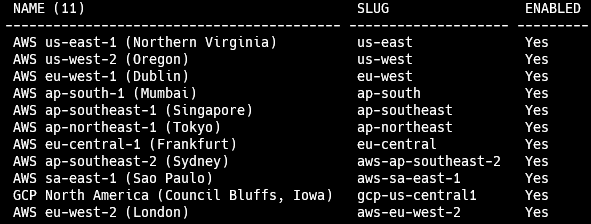
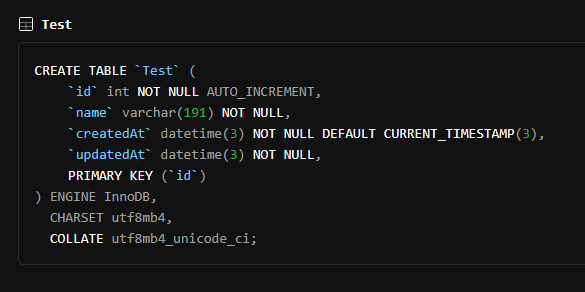

PlanetScale을 이용해 데이터베이스를 생성하고, Prisma를 연결하는 두 가지 방법이 존재합니다.

- pscale
- PlanetScale 웹사이트

PlanetScale 웹사이트를 사용하여 데이터베이스를 연결하는 방법은 매우 간단하므로 pscale을 사용하는 방법에 대해 다룹니다.

## 데이터베이스 생성하기

1. region list 확인합니다.

```bash
pscale region list
```



2. 원하는 region에 데이터베이스를 생성합니다.

```bash
pscale database create [DB_NAME] --region [REGION_SLUG]
```

## 데이터베이스와 Prisma와 연결하기

1. 데이터베이스 서버의 주소를 확인합니다.

```bash
pscale connect [DB_NAME]
```

2. 데이터베이스의 주소를 `.env`파일에 입력합니다.

```bash title=".env"
# 1번 단계에서 할당받은 주소를 000.0.0.0:1234라고 가정합니다.

DATABASE_URL='mysql://000.0.0.0:1234/[DB_NAME]'
```

3. `schema.prisma` 파일에 `referentialIntegrity` 옵션을 추가합니다. (선택 사항)

```ts title="schema.prisma"
generator client {
  provider        = "prisma-client-js"
  // highlight-next-line
  previewFeatures = ["referentialIntegrity"]
}

datasource db {
  provider             = "mysql"
  url                  = env("DATABASE_URL")
  // highlight-next-line
  referentialIntegrity = "prisma"
}
```

:::tip 이 작업을 진행하는 이유

- `SQL`의 `foreign key`가 가리키는 데이터가 존재하지 않으면 에러를 발생시킵니다.
- 하지만, `PlanetScale`이 사용하는 `vitess`는 확장에 특화된 서비스이기 때문에 존재하지 않는 데이터를 지정할 수 있습니다.
- 이 설정을 통해 `Prisma`는 `PlanetScale`이 `SQL`처럼 동작하도록 만들 수 있습니다.

:::

4. 성공적으로 연결되었는지 확인하기 위해 임의의 `model`을 생성하고 변경 내용을 `push`합니다.

```ts title="schema.prisma"
model Test {
  id        Int      @id @default(autoincrement())
  name      String
  createdAt DateTime @default(now())
  updatedAt DateTime @updatedAt
}
```

```bash
npx prisma db push
```

4. PlanetScale 웹 사이트에 접속 후, Table을 클릭하고 아래와 같은 테이블이 추가되어 있다면 성공적으로 연결된 것입니다.


